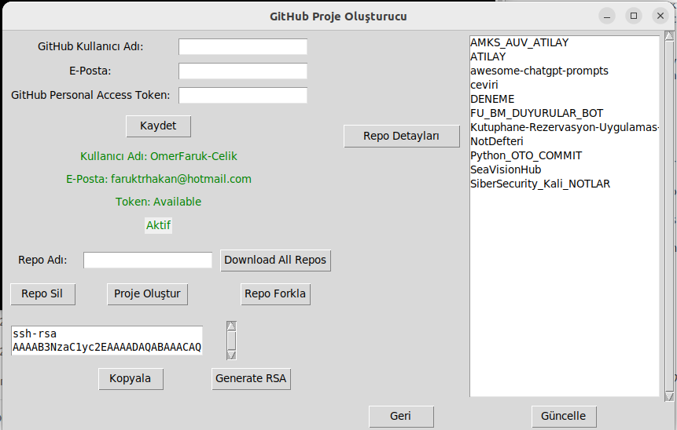
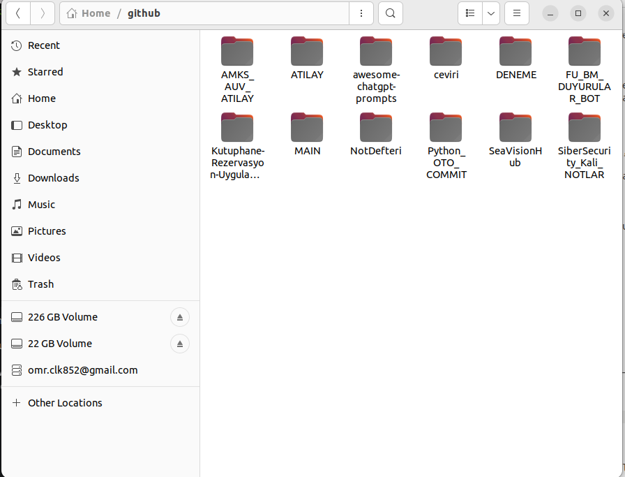

# Python_OTO_COMMIT: Geliştirici Verimliliğini Artıran Otomatik Git İşlemleri Aracı

## ⏱️ Zamanınızı Geri Kazanmanız İçin

Geliştirme sürecinizde, dosyalarınızı düzenli bir şekilde Git'e ekleme, commit etme ve GitHub'a gönderme işlemleri zaman alıcı olabilir. Özellikle, yoğun ve hızlı bir çalışma temposunda bu işlemler, odaklanmanızı ve üretkenliğinizi etkileyebilir.

**Python_OTO_COMMIT**, bu sıkıcı ve zaman alıcı görevleri otomatikleştirerek,  geliştirme sürecini hızlandırmanıza ve odaklanmanızı kodlamaya yönlendirmenize yardımcı olan bir araçtır.

## 🚀  Python_OTO_COMMIT'in Özellikleri:

* **Otomatik Commit ve Push:**  Bir düğmeye basarak, tüm dosyalarınızı Git'e ekler,  bir commit oluşturur ve GitHub'a gönderir.
* **Kullanıcı Dostu Arayüz:**  Kullanıcı dostu bir arayüz sayesinde,  komut satırı kullanma konusunda deneyiminiz olmasa bile kolayca kullanabilirsiniz.
* **Zaman Tasarrufu:**  Tekrarlayan Git işlemlerini otomatikleştirerek,  vaktinizi daha önemli görevlere ayırmanıza olanak tanır.
* **Daha İyi Sürüm Yönetimi:**  Düzenli commit ve push işlemleri, projenizin sürüm yönetimini kolaylaştırır ve daha iyi bir kod geçmişi oluşturmanıza yardımcı olur.
* **Esneklik:**  Ayarlanabilir seçeneklerle, commit mesajlarını, GitHub deponuzun adını ve diğer parametreleri kişiselleştirebilirsiniz.

## 💻 Kurulum

1. **Gerekli Paketleri Yükleme:**
   ```bash
   pip install -r requirements.txt

   ```bash
	git clone https://github.com/OmerFaruk-Celik/Python_OTO_COMMIT.git
	cd Python_OTO_COMMIT
	chmod +x ./INSTALL
	./INSTALL


Bu işlem adımlarından sonra eğer repo başarıyla yüklenmişse repo arayüzü açılacaktır. Sonrasında terminale repo yazarak kullanıcı arayüzüne ulaşabilirsiniz.

#Repo Arayüzü


Buradan github bilgilerini girdikten sonra github sayfanızdan token alıp Token kısmına yapıştırıyorsunuz. Sonrasından oluşturduğunu rsa_id'nizi yine github sayfanızda yeni ssh oluştur kısmına yapıştırdıktan sonra kayıt işlemi bitiyor. Bundan sonra Python_OTO_Commit masaüstüne indirdiğiniz repolarınızda yaptığınız değişiklikleri her dakika başı kontrol edip github hesabına yansıtıyor.

#Masaüstü Kullanımı

